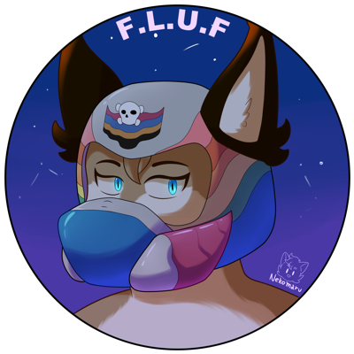

## What is FLUF

FLUF is a client/server framework for the video game Freelancer (2003). It is designed to make
the game easier to write C++ code edits for and provide a set of common utils and APIs. New code
units are called 'modules' (to be distinct from FLHook plugins) and a collection of core modules
are available within this repo, as well as some example ones provided.

## Core Module Features

The core modules provided are as follows:

### FLUF

The main dll, this handles all the hooks and lifecycles, as well as loading and managing of all
other modules

### FLUF.UI

This module provides common APIs for rendering things onto the client's screen and manipulating the vanilla game's
UI elements. The project uses ImGui for rendering new elements as an overlay that is injected into game's existing
render pipeline (so the cursor sits on top of the ImGui windows).

[See more](https://fluf.the-starport.com/api/modules/data/fluf_ui.html).

### FLUF.CrashWalker

This module adds enhanced error checking and stability patches that significantly reduce the amount of crashing
the client/server might do. If a crash occurs, it will pull the latest crash offsets from the Starport Knowledgebase
and see if the error code that occurred was in the there and inform the user of the cause if possible. Otherwise,
it will create a memory dump that can be reviewed by mod developers to discern a cause.

[See more](https://fluf.the-starport.com/api/modules/data/fluf_crash_walker.html).

## Building

## Requirements

This project can be build on both Linux and Windows. Both assume that Python 3.11+ is installed.

For Windows you should have Visual Studio 2022 installed with all the latest libs. This project builds with the v143
toolchain and C++20.

Linux requires compilation to be done through [MSVC Wine](https://github.com/mstorsjo/msvc-wine). Follow the
instructions there for setting it up. Once setup in your directories of choice, add these to your .bashrc
(or convert to your shell of choice):

```shell
# MSVC
MSVC="PATH_TO_MSVC"
# e.g. MSVC="$HOME/msvc"
export MSVC
source $MSVC/bin/x86/msvcenv.sh

# User specific environment
if ! [[ "$PATH" =~ "$MSVC/bin/x86" ]]; then
    PATH="$MSVC/bin/x86:$PATH"
    PATH="$MSVC/bin:$PATH"
    PATH="$MSVC/kits/10/Lib/10.0.22621.0/um:$PATH"
    PATH="$MSVC/VC/Tools/msvc/14.41.34120/lib:$PATH"
fi
export PATH
```

For both Windows and Linux, once all the prerequisite steps are completed the build steps are the same and the
following commands can be run:

```
pip install -r requirements.txt
python cli.py configure
python cli.py build
```

`--help` can be appended to `configure` and `build` to see additional options.
Once these commands have been run you can open the folder with an IDE of your choice,
like Visual Studio Code or CLion.

### Post Build

On successful build, a [python script](https://github.com/TheStarport/FLUF/blob/master/scripts/post_build.py)
will run that copies all of the build artefacts into the dist folder.
If you set `BINARY_COPY_DESTINATION` in `build.conf`, it will also copy the entire contents of that folder to
the specified destination directory. It must be an absolute directory, and any backslashes must be escaped.

### GOTCHYAs & Troubleshooting

- This project uses CMake presets, ensure that your IDE supports them and has any needed extensions.
  VSCode for instance, requires a CMake plugin in order to function.
- When using CLion on Windows, the default toolchain is often not correct and overrides some of the
  conan build settings. Ensure that the active toolchain looks like
  [this](https://github.com/TheStarport/FLUF/blob/master/.github/images/clion.png).

## Docs

Building the documentation can be done with the following commands:

```
pip install -r requirements.txt
doxygen Doxyfile
cd docs
sphinx-build -M html . ./_build
python -m http.server 5000 -d ./_build/html
```

## Credits

- [Lazrius](https://github.com/Lazrius) - Project Creator
- [Aingar](https://github.com/Aingar)  - Co-Creator, significant help with reverse engineering and hook creation
- [BeagleRush](https://www.twitch.tv/beagsandjam) - Commissioned the RaidUI module
- [Nekomaru](https://linktr.ee/nekomaru10) - Artist who created the icon